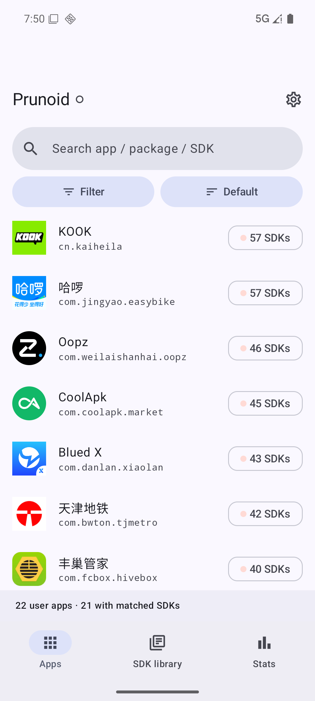
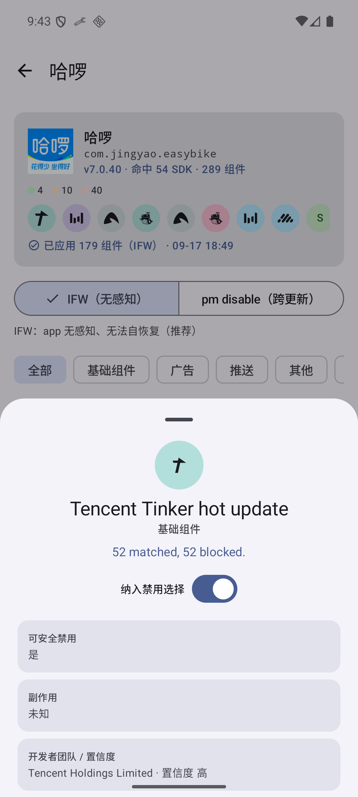
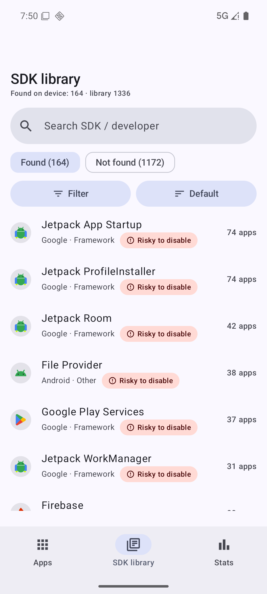
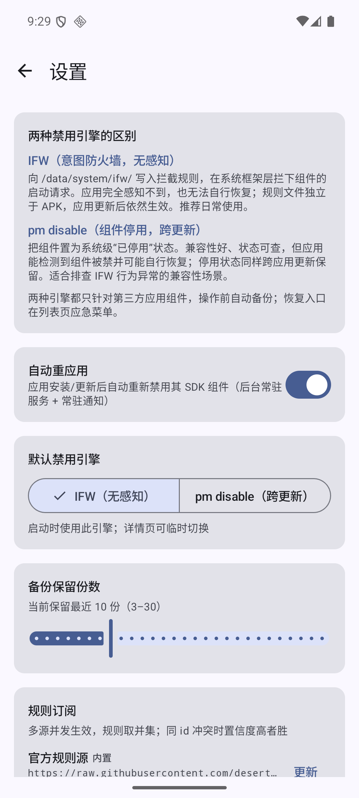
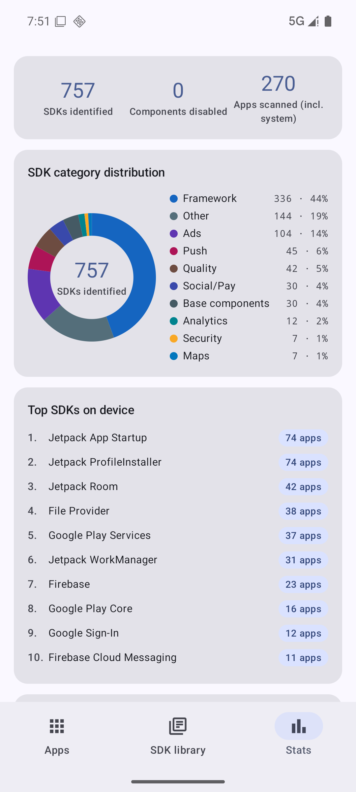
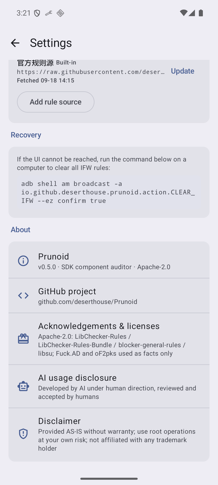

<div align="center">

# Prunoid

**Android SDK component auditor & blocker — pruner + paranoid + Android**

See every SDK embedded in your apps, and decide which components to block

[](LICENSE)
[](#-compatibility)
[](#-getting-started)
[](https://github.com/deserthouse/Prunoid/releases)

[简体中文](README.md) · [English](README_EN.md)

</div>

---

> ⚠️ **This project is still at a very early stage.** Make sure you have read and fully understood this document before you start using it. No promises are made about its future: it may see large-scale changes and refactors, may change direction, and may be abandoned or stop being maintained at any time.

> **Prunoid** is a root-required Android tool that scans every installed app, identifies embedded ad / analytics / push SDKs, and selectively blocks their components through the system-level Intent Firewall — **without hooking the target app**. Apps can't detect it, and can't recover.

## ✨ Features

### Identification

- **Three-way matching**: app package prefixes + exact component anchors + class-name prefixes, against a 1,900+ SDK ruleset (built-in snapshot, extensible via subscription)
- **4-level safety grading**: safe / caution / risky / unknown — every rule carries sources and a confidence level
- **SDK archive sheet**: brand icon, description, dev team, side effects, rule contributors
- **Unrecognized components view**: unmatched components clustered by package prefix, with heuristic "suspected ad/analytics" hints (advisory only, never auto-blocked)

### Block & restore

| Engine | Mechanism | Notes |
|---|---|---|
| **IFW (primary)** | writes rules to `/data/system/ifw/` | invisible to apps, cannot self-recover; survives app updates |
| **pm disable (secondary)** | system-level component disable | good compatibility; apps may detect and re-enable; survives updates |

- Per-SDK checkboxes, category filters (ads/analytics/push…), select-all-filtered one-tap block
- **Auto reapply** after app install/update (foreground guard service; toggleable)
- **Safety layer (non-removable)**: mandatory pre-apply backup; per-app restore / backup restore / clear-all / adb emergency broadcast; hard whitelist block on framework packages (bootloop-proof by design)

### Rules ecosystem

- **Multi-source subscription**: official + custom sources merged (same-id conflicts resolved by confidence); self-hosting supported
- **SDK library browser**: full ruleset in Found / Not-found sections
- **Community**: standalone Apache-2.0 rules repo, PRs + CI validation, per-rule `sources[]` attribution

## 📸 Screenshots

<p float="left">
  
  
  
  
  
  
</p>

## 🚀 Getting started

**[📥 Download the latest release](https://github.com/deserthouse/Prunoid/releases)**

Requirements: Android 12+ (API 31), rooted (Magisk or similar).

1. Install the APK, grant notification permission (guard service)
2. Grant root access
3. Open any app → review matched SDKs (archive sheet shows description / side effects / contributors)
4. Check the SDKs to block (safe/caution pre-checked) → Apply
5. Something broke? Restore from the in-app emergency dialog, or clear all IFW rules over adb

## ❓ FAQ

**Will blocking crash apps?** Possibly. Rules carry 4-level grading and side-effect notes; risky ones require explicit opt-in. Every operation is preceded by an automatic backup and can be reverted.

**Can apps detect the blocking?** Not with the IFW engine — interception happens at the framework level. The pm engine can be detected and re-enabled by apps.

**Do rules survive app updates?** Yes. IFW rule files are independent of the APK, and the guard service re-applies them incrementally after updates.

**Relationship to Blocker / Thanox?** Prunoid's cold-start ruleset merges blocker-general-rules (Apache-2.0) and LibChecker-Rules anchors; icons & descriptions come from LibChecker-Rules-Bundle (Apache-2.0, see NOTICE). Independent projects, no affiliation.

**Does it phone home?** Network access only when you actively subscribe/refresh a rule source. No telemetry, no crash reporting, no data upload.

## 📊 Compatibility

| Item | Status |
|---|---|
| Min | Android 12 (API 31) |
| Target | Android 17 (API 37) |
| Verified | Android 16 (API 36) end-to-end (rooted emulator, incl. 6 real-world CN app samples) |
| Root | Magisk tested; any root that can write `/data/system/ifw/` should work |
| Non-root (Shizuku/ADB) | Not supported — shell identity cannot change normal app component state (AOSP limitation) |

## 🛠️ How it works

```
┌────────────┐   scan (PackageManager, 4 component types)
│  Prunoid   │ ──────────────▶ three-way rule match ──▶ SDK report
│  (root)    │
│            │   apply (auto backup first)
│  IFW       │ ──────────────▶ /data/system/ifw/<pkg>.xml (grouped by type)
│  pm        │ ──────────────▶ pm disable <pkg>/<component>
│            │
│  guard     │ ◀── PACKAGE_ADDED/REPLACED ── incremental reapply
└────────────┘
```

- **Third-party apps only** — framework packages are hard-blocked by whitelist; no inherent bootloop path.

## 🤝 Acknowledgements

- **[LibChecker / LibChecker-Rules / LibChecker-Rules-Bundle](https://github.com/LibChecker)** — component anchors, brand icons and descriptions (Apache-2.0)
- **[lihenggui / blocker-general-rules](https://github.com/lihenggui/blocker-general-rules)** — 467 block rules with safeToBlock/sideEffect (Apache-2.0)
- **[topjohnwu / libsu](https://github.com/topjohnwu/libsu)** — root shell (Apache-2.0)
- **[topjohnwu / Magisk](https://github.com/topjohnwu/Magisk)** — foundation of the verification environment

## 🔐 Permission disclosure (QUERY_ALL_PACKAGES)

Prunoid requests `QUERY_ALL_PACKAGES` solely to enumerate installed apps and scan their component manifests — SDK components are not limited to apps with launcher icons. No data collection, no telemetry; network access is limited to user-initiated rule-subscription fetches.

## ⚠️ Disclaimer

> A personal hobby project provided "as is", without warranty of any kind.
>
> - **No functional guarantee** across devices/ROMs; custom ROM behavior may vary.
> - **No roadmap commitment**; development may slow or stop at any time.
> - **Use at your own risk** — blocking components may affect app functionality (push, login, etc.); rooting carries its own risks.
> - **No affiliation** with Google/Android or any vendor/project mentioned; trademarks belong to their owners.
> - **Use determines purpose**; the developer is not responsible for misuse.

Full bilingual statement: [DISCLAIMER.md](DISCLAIMER.md).

## 🤖 AI Disclosure

> This project was developed with heavy AI (LLM) assistance — architecture, implementation, testing and documentation — under human direction, review and final decision authority ([@deserthouse](https://github.com/deserthouse)).

## ⚖️ License

Apache-2.0. The ruleset lives in [Prunoid-Rules](https://github.com/deserthouse/Prunoid-Rules) (Apache-2.0) with per-rule `sources[]` attribution; icon/description assets originate from LibChecker-Rules-Bundle (Apache-2.0, see [NOTICE](NOTICE)).

---

<div align="center">

If this project helps you, a ⭐ would be appreciated

</div>
